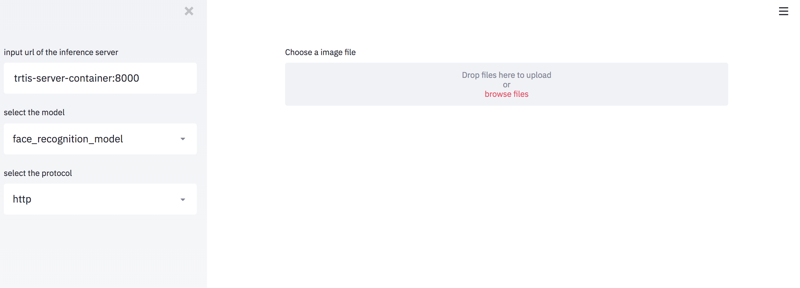

# Face Recognition Server

## Introduction

Face Recognition Server is the service to detect the face in image and recognize someone.
This service use [TensorRT Inference Server](https://github.com/NVIDIA/tensorrt-inference-server).

## Environment

* Docker
* Docker-Compose
* git

## Container Architecture

This repository create the following container.

| Name | Category | Description |
|:----:|:----:|:-----|
|Server Container|Server|Main container in Server|
|Custom-Backend Container|Server|Build the face recognition model in this container|
|Data upload Container|Server|Upload the face data into server|
|Cliend Container|Client|Main container in Client|

## Setup and Use service

### Build & Run each containers

need to execute the following command.
```
$ bash setup_trtis_docker_containers.sh
```

After above command is executed, all containers will be created in one host machine and run.

### Use service

* open the browser and access "http://localhost:8501"

* following page will be displayed
  * This main page is displayed using [streamlit](https://github.com/streamlit/streamlit)



### add face data

* open the browser and access "http://localhost:8502"

## Other information

### setup docker container without building docker images

need to execute the following command.
```
$ bash setup_trtis_docker_containers.sh --no-build
```

### setup docker container without using docker cache

need to execute the following command.
```
$ bash setup_trtis_docker_containers.sh --no-cache
```

### setup only client docker container

```
$ bash setup_trtis_docker_containers.sh --only-client
```

### setup only server docker container

```
$ bash setup_trtis_docker_containers.sh --only-server
```

### setup docker containers with GPU

```
$ bash setup_trtis_docker_containers.sh --use-gpu
```
